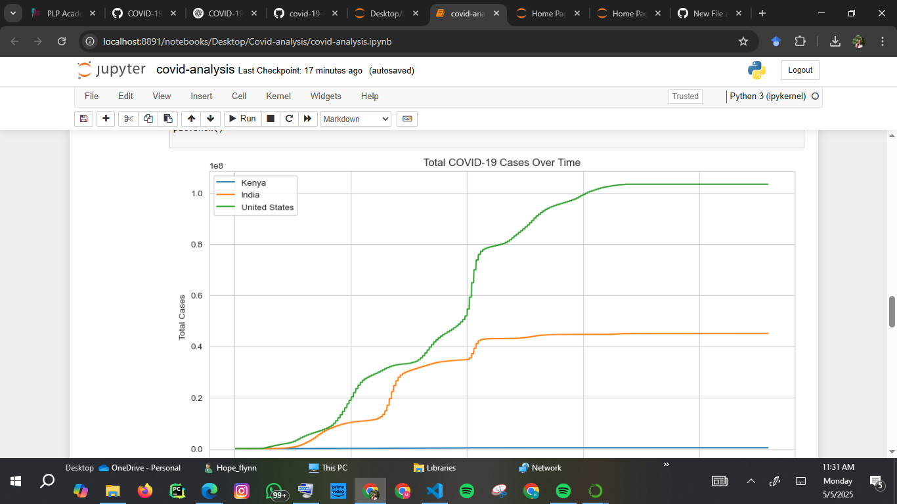
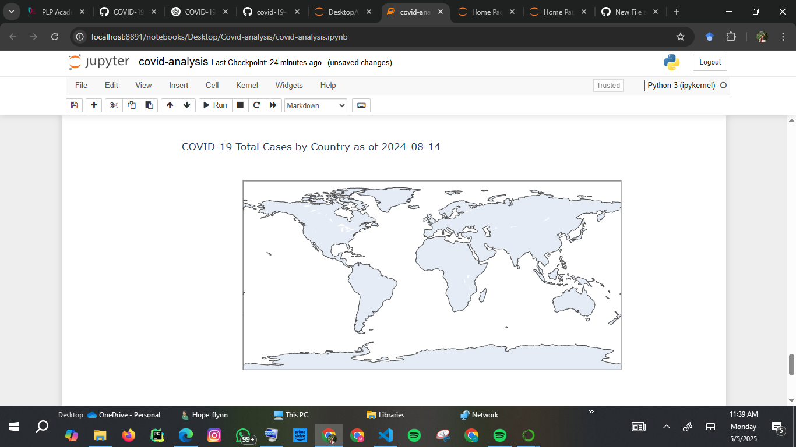

# COVID-19 Data Analysis and Visualization 🦠📊

This project provides an in-depth analysis of global COVID-19 data sourced from [Our World in Data](https://ourworldindata.org/coronavirus). Using Python and data visualization libraries, the project highlights trends in cases, deaths, and vaccination progress across selected countries.

---

## 🎯 Objectives

- Load and explore real-world COVID-19 data
- Perform data cleaning and preparation
- Analyze and compare total cases, deaths, and vaccinations
- Create visualizations to represent global trends
- Extract meaningful insights from the data

---

## 🛠️ Tools & Libraries Used

- Python
- Jupyter Notebook
- pandas
- matplotlib
- seaborn
- plotly.express

---

## 🚀 How to Run the Project

1. Clone this repository:
   ```bash
   git clone https://github.com/HopeFlynn/covid-analysis.git
````

2. Open the `covid_analysis.ipynb` file in Jupyter Notebook.
3. Ensure the CSV file `owid-covid-data.csv` is in the same folder.
4. Run all cells from top to bottom to see the analysis and visualizations.

---

## 💡 Insights & Reflections

* The USA recorded the highest number of total COVID-19 cases globally.
* India showed a major rise in vaccination rates after May 2021.
* Kenya had fewer cases and deaths but also fewer vaccinations.
* Interactive charts and choropleth maps made trends and disparities more visually apparent.
* Working with real data provided hands-on experience with data analysis workflows.

---

## 📊 Dataset Source

* **Our World in Data:** [owid-covid-data.csv](https://ourworldindata.org/coronavirus)

## Visualizations






